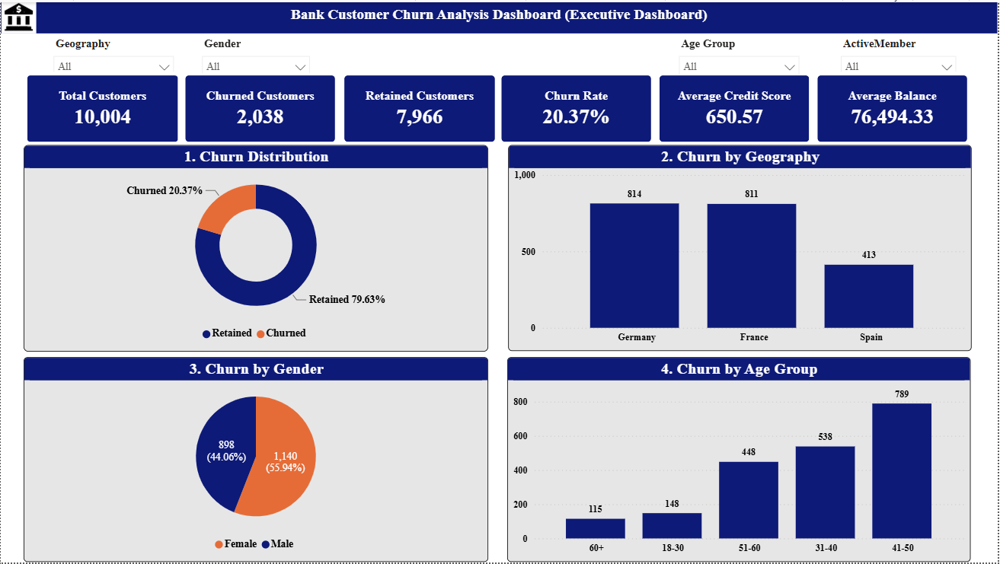
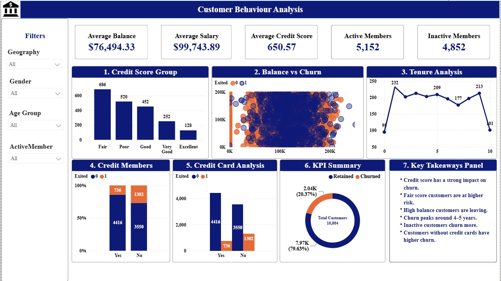
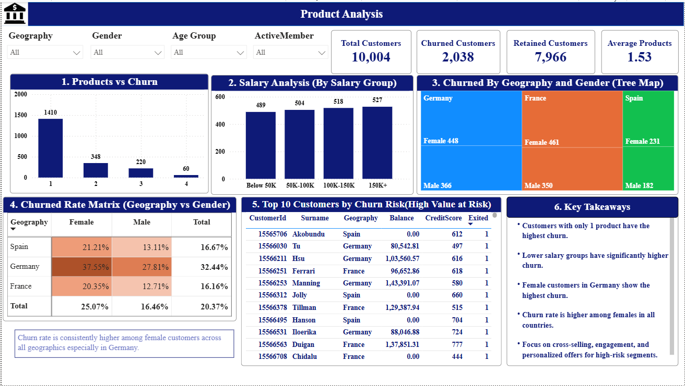

# Bank-Customer-Churn-Analysis
Power BI Dashboard for Bank Customer Churn Analysis

## Project Overview

This project analyzes bank customer data to identify customer churn patterns, customer behavior, and high-risk customer segments.

The dashboard was created using Microsoft Power BI to provide interactive insights into customer churn based on geography, gender, age, credit score, salary, balance, number of products, and other customer attributes.

## Dataset

The dataset contains bank customer information including:

- Customer ID
- Surname
- Geography
- Gender
- Age
- Credit Score
- Balance
- Estimated Salary
- Tenure
- Number of Products
- Has Credit Card
- Is Active Member
- Exited

Total Customers: 10,004

## Tools Used

- Microsoft Power BI
- Power Query
- DAX
- Microsoft Excel
- GitHub

## KPIs

- Total Customers: 10,004
- Churned Customers: 2,038
- Retained Customers: 7,966
- Churn Rate: 20.37%
- Average Credit Score: 650.57
- Average Balance: 76,494.33
- Average Products: 1.53

## Dashboard Pages

### 1. Executive Dashboard

Provides an overall view of customer churn through:

- Churn Distribution
- Churn by Geography
- Churn by Gender
- Churn by Age Group
- Total Customers
- Churned Customers
- Retained Customers
- Churn Rate
- Average Credit Score
- Average Balance

### 2. Customer Behaviour Analysis

Analyzes:

- Credit Score Groups
- Balance vs Churn
- Tenure Analysis
- Active Members
- Credit Card Analysis
- KPI Summary
- Key Takeaways

### 3. Product Analysis

Analyzes:

- Products vs Churn
- Salary Groups
- Churn by Geography and Gender
- Churn Rate Matrix
- Top 10 Customers by Churn Risk
- Key Takeaways

## Key Insights

- Customers with only 1 product have the highest churn.
- Lower salary groups have significantly higher churn.
- Female customers in Germany show the highest churn.
- Churn rate is higher among females across all countries.
- Customers with lower credit scores show higher churn risk.
- Inactive members show higher churn.
- Customers without credit cards have higher churn.
- High-risk customer segments can be targeted with personalized offers and engagement strategies.

## Screenshots

### Executive Dashboard

### Customer Behaviour Analysis

### Product Analysis

## Files Included

- `README.md` - Project documentation
- `.pbix` - Power BI dashboard file
- `.pdf` - Dashboard PDF
- `ExecutiveDashboard.png` - Executive dashboard screenshot
- `CustomerBehaviourAnalysis.png` - Customer behaviour dashboard screenshot
- `ProductAnalysis.png` - Product analysis dashboard screenshot
